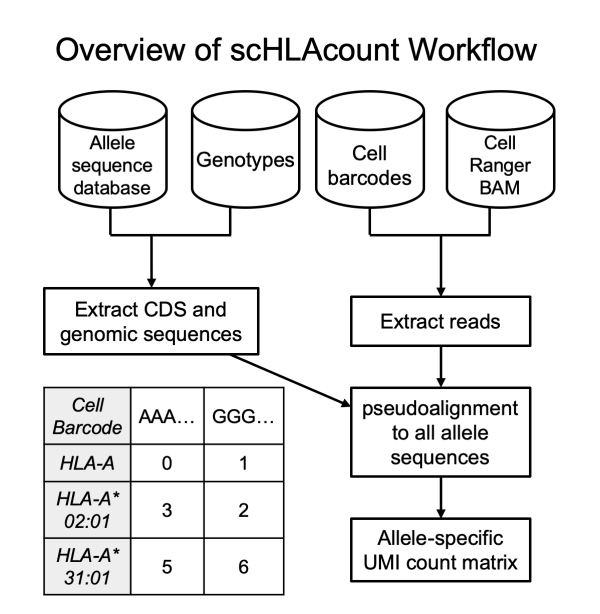

# scHLAcount

## Overview
scHLAcount allows you to count molecules in single-cell RNA-seq data for class I genes HLA-A, B, and C; and class II genes DPA1, DPB1, DRA1, DRB1, DQA1, and DQB1 using a personalized reference genome. You can either use provided HLA types determined by alternative methods or call HLA types with this tool then quantify against those calls. See the [Using scHLAcount](#using-schlacount) section for more details.



## Uses
scHLAcount can be used to look at allele specific expression of HLA genes. It can also be used to evaluate loss of heterozygosity by overlaying cell-specific counts onto an expression based t-SNE projection and looking for clusters with complete loss of one haplotype. General loss of HLA expression can also be evaluated with scHLAcount, and performs better at this task than default Cell Ranger, particularly in the case where the sample has HLA haplotypes that are diverged from the reference.

```
scHLAcount DEV

HLA genotyping and allele-specific expression for single-cell RNA sequencing

USAGE:
    sc_hla_count [FLAGS] [OPTIONS] --bam <FILE> --cell-barcodes <FILE>

FLAGS:
        --use-exact-count       If specified, will use exact alignment to allele sequences to count moleucles (very slow!)
    -h, --help                  Prints help information
        --primary-alignments    If specified, will use primary alignments only
        --unmapped              If specified, will also use unmapped reads for genotyping
    -V, --version               Prints version information

OPTIONS:
    -b, --bam <FILE>                    Cellranger BAM file
    -c, --cell-barcodes <FILE>          File with cell barcodes to be evaluated
    -f, --fasta-cds <FILE>              Multi-FASTA file with CDS sequence of each allele [default: ]
    -g, --fasta-genomic <FILE>          Multi-FASTA file with genomic sequence of each allele [default: ]
    -d, --hladb-dir <PATH>              Directory of the IMGT-HLA database [default: ]
    -i, --hla-index <FILE>              debruijn_mapping pseudoalignment index file constructed from IMGT-HLA database [default: ]
        --log-level <log_level>         Logging level [default: error]  [possible values: info, debug, error]
    -o, --out-dir <OUTPUT_DIR>           [default: hla-typer-results]
        --pl-tmp <PSEUDOALIGNER_TMP>    Directory to write the pseudoaligner temporary files generated [default: pseudoaligner_tmp]
    -r, --region <STRING>               Samtools-format region string of reads to use [default: 6:28510120-33480577]
```  

## Limitations

While scHLAcount can determine HLA haplotypes given a HLA database like the one at IMGT, our testing has shown that alternative tools such as [arcasHLA](https://github.com/RabadanLab/arcasHLA) perform better at HLA genotyping. Therefore, we recommend that you use either alternative methods or arcasHLA to determine your genotypes before using scHLAcount to assign allele specific counts in your single cell RNA-seq dataset.

We have determined that the best results for genotyping and allele-specific counting are found with 5' GEX data. There is a much stronger coverage bias towards the end of the transcript in 3' GEX data, which poses a problem for genotyping and molecule counting of class I genes because most of the variable sites between these three paralogs are contained in exons 2 and 3, which are at the 5' end of the transcript. The following figure shows the coverage profile for 5', 3'v2 and 3'v3 GEX assays, normalized to 0 and 1 for the minimum and maximum coverage seen in the region, respectively, for each assay.


## Installation

scHLAcount has automatically generated downloadable binaries for generic linux and Mac OSX under the [releases page](https://github.com/10XGenomics/scHLAcount/releases). The linux binaries are expected to work on [our supported Operating Systems](https://support.10xgenomics.com/os-support). 

## Compiling from source
scHLAcount is a standard Rust executable project, that works with stable Rust >=1.13.

If you need to compile from source, [install Rust](https://www.rust-lang.org/en-US/install.html), then type `cargo build --release` from within the directory containing the scHLAcount source code. The executable will appear at `target/release/sc_hla_count`. As usual it's important to use a release build to get good performance.

## Testing
If you have compiled scHLAcount from source, you can run the tiny test dataset by typing the command `cargo test --release` from wthin the directory containing the scHLAcount source code.

The test data files in the `test/` folder also provide a simple example of the inputs and outputs for scHLAcount.

## Support 

scHLAcount is provided as an open-source tool for use by the community. Although we cannot provide full support for the software please submit a GitHub Issue if you have any problems, questions or comments. We would also be happy to consider Pull Requests that fix bugs or provide enhancements.

Scripts in the `/paper` directory show how to reproduce results from our manuscript and are not supported.

# Using scHLAcount

## Case 1: You have HLA genotypes for some or all class I / class II genes

Other Requirements: samtools  

1. Download the the IMGT/HLA database, available at [Github](https://github.com/ANHIG/IMGTHLA) or [FTP](ftp://ftp.ebi.ac.uk/pub/databases/ipd/imgt/hla/). You only need the `hla_gen.fasta` and `hla_nuc.fasta` files, but you can download the whole database if you choose.
2. Use `samtools faidx` to index the `hla_gen.fasta` and `hla_nuc.fasta` files. 
3. Create a file of the known genotypes, at most two per gene, with one genotype on each line. Follow the template at `paper/sample_gt.txt`. 
4. We strongly recommend that if genotypes are unknown for any of the genes, you put the reference genome allele for those genes in the known genotypes file. Alleles represented in the GRCh38 primary assembly are listed below:
```
A*03:01:01:01
B*07:02:01:01
C*07:02:01:01
DQA1*01:02:01:01
DQB1*06:02:01:01
DRB1*15:01:01:01
DPA1*01:03:01:01
DPB1*04:01:01:01
```
5. If the indexed IMGT/HLA database files are not in the current directory, edit the `prepare_reference.sh` file to point to these files.
6. Run `prepare_reference.sh known_genotypes.txt` to get your custom references `cds.fasta` and `gen.fasta`. The samtools command will fail if the coding and genomic sequence of all alleles specified are not present in the database! If multiple alleles are present that match the provided level of specificity of the genotype, one will be chosen arbitrarily.
7. Run scHLAcount with the custom references as `-f` and `-g` parameters. Do not use the `-i` and `-d` parameters.


## Case 2: You do not have HLA genotypes

1. Download the the IMGT/HLA database, available at [Github](https://github.com/ANHIG/IMGTHLA) or [FTP](ftp://ftp.ebi.ac.uk/pub/databases/ipd/imgt/hla/). You only need the files `hla_gen.fasta`, `hla_nuc.fasta`, and `Allele_status.txt` but you can download the whole database if you choose.
2. The directory containing these files should be provided as the `-d` parameter to scHLAcount.
3. Run scHLAcount with the `-d` parameter. Do not use the `-f`, `-g`, or `-i` parameters.
4. If you run the program again and want to skip building the index, just specify the file `hla_nuc.fasta.idx` as the `-i` parameter. This file is located in the pseudoaligner temporary folder specified by the `--pl-tmp` parameter.
5. If you run the program again on and want to skip calculating the genotypes, you can use the `pseudoaligner_nuc.fa` and `pseudoaligner_gen.fa` as the `-f` and `-g` parameters. These files are located in the pseudoaligner temporary folder specified by the `--pl-tmp` parameter.

## Outputs
scHLAcount produces genome matrices in the same [Market Exchange](https://support.10xgenomics.com/single-cell-gene-expression/software/pipelines/latest/output/matrices) format that Cell Ranger uses. This is a sparse matrix format that can be read by common packages. Column labels are the cell barcodes included in the cell barcode input file (specified with `--cell-barcodes`).


## Genotyping Algorithm Details

If HLA genotypes are not available, scHLAcount provides a preliminary implementation of a genotyping algorithm similar to the one demonstrated on bulk RNA-seq data in arcasHLA (Orenbuch et al., Bioinformatics 2019) and HLApers (Aguiar et al., PLoS Genetics 2019). Although 5' and 3' Gene Expression read coverage is highly skewed towards one end of the transcript (see [Limitations](#using-schlacount)) we have found that combining reads from all cells has enough coverage along the length of the transcript to achieve similar results to those demonstrated in bulk RNA-seq. 

We use the `Allele_status.txt` metadata file from the IMGT/HLA database to select the full-length coding sequences of alleles from hla_nuc.fasta for genes HLA-A, -B, -C, DPA1, DPB1, DRA1, DRB1, DQA1, and DQB1 in the IMGT HLA database that also have complete genomic sequences available. We exclude null alleles (with suffix of N) because by definition, we would never call these genotypes from RNA sequencing data. A colored deBruijn graph of these alleles is constructed using k-mer size 24.  We build on the Rust [debruijn_mapping](https://github.com/10XGenomics/rust-pseudoaligner) crate. From the aligned BAM file, all reads aligned to the MHC region (default is GRCh38 coordinates 6:28510120-33480577) are pseudo-aligned to the graph, and the set of alleles to which they align (''equivalence class'') is reported, if the length of the alignment is at least 40 bases, with up to 2 mismatches permitted outside the initial seed. Expectation maximization (EM) is performed on the equivalence class counts, with the accelerated implementation SquareM of Varadhan and Roland (Scandinavian J of Statistics, 2008). 

For each of the eight HLA genes included in the graph, we rank the alleles of that gene by weight in the EM. To determine the diploid genotype, we consider all pairs of alleles that explained at least 100 reads (a pair of alleles explains a read if the read pseudoaligned to an equivalence class containing either allele sequence). We select the pair of alleles that explain the most reads, if the number of reads explained by the 2nd allele alone is at least 15% of the reads explained by the 1st allele. If this is not true, we report only a single genotype: the highest ranked by weight in the EM. For each gene, we report the top 5 allele pairs ranked by number of reads explained, and the top 10 alleles ranked by EM weight in an auxiliary output file, found in the pseudoaligner temporary folder specified by the `--pl-tmp` parameter. This metadata is useful to gauge confidence in the reported genotypes compared to other contenders. The coding sequence of the allele or pair from `hla_nuc.fasta` and the genomic sequence from `hla_gen.fasta` (IMGT/HLA database) are written to FASTA format files for all genes.

## Molecule Counting Algorithm Details

Using multi-FASTA files of the coding and genomic sequences of alleles (generated using `prepare_reference.sh` from a list of genotypes or internally by scHLAcount), two colored de Bruijn graph indexes are built using k-mer size 24. One graph contains coding sequences and one contains genomic sequences. From the aligned BAM file, each read aligned to the MHC region (default is GRCh38 coordinates 6:28510120-33480577) is first pseudo-aligned to the coding sequence graph. If there is no alignment of at least 60 bases (2 mismatches are permitted outside the initial seed), the read is pseudo-aligned to the genomic sequence graph and retained if the alignment is at least 60 bases. In the datasets we've studied, less than 5% of reads with any alignment were aligned to the genomic sequence. The genomic sequence step provides a failsafe for samples that are derived from nuclei, haplotypes with short CDS assemblies in the database, and the occasional read from intronic or UTR sequences.

Reads are then collated by molecule, which in 10x Genomics data comprises the 12bp cell barcode (CB) and 10bp unique molecular identifier (UMI). All reads sharing a CB and UMI originated from the same RNA molecule, but individual reads may have different equivalence classes according to the pseudoalignment. We only retain reads where the equivalence class corresponds to a single allele (in which case the read is assigned to that allele; e.g. HLA-A*02:01) or the two alleles of the same gene (the read is assigned to the gene; e.g. HLA-A). If at least half of the reads from a molecule are assigned to a particular gene, the molecule is assigned to that gene or one of its alleles using a consensus of the constituent reads’ equivalence classes. Now only considering the reads from the molecule assigned to the most prevalent gene, if both or neither allele have at least 10% of the reads, the molecule is assigned to the gene. Otherwise, the molecule is assigned to the more prevalent allele.

## Advanced Parameter Specifications

Default parameters were selected based on our test datasets with genotypes with two or three-field resolution, where we expect the personalized reference to have very few mismatches with the allele present in the reads. scHLAcount selects an arbitrary allele from the database consistent with the provided genotypes. If the genotypes provided are lower-resolution (e.g. the one-field genotype A\*02 is lower-resolution than the three-field genotype A\*02:01:01), scHLAcount arbitrarily selects a representative sequence from all A\*02 alleles. Therefore, when only lower-resolution genotypes are available, the pseudoalignments of reads to the personalized reference may contain more mismatches and users may want to decrease the k-mer length or decrease the minimum significant alignment length.

k-mer length is set to 20 in the debruijn_mapping crate. To change the k-mer length, you need to clone the repo of this crate, change [its configuration file](https://github.com/10XGenomics/rust-pseudoaligner/blob/master/src/config.rs), and change the [scHLAcount Cargo.toml file](https://github.com/10XGenomics/scHLAcount/blob/master/Cargo.toml#L11) to point to your local, modified version of the debruijn_mapping crate. Then you will need to re-compile the scHLAcount program.

Other scHLAcount-specific parameters are specified in our configuration file [here](https://github.com/10XGenomics/scHLAcount/blob/master/src/config.rs) and are described below. After changing the configuration file, you will need to re-compile the scHLAcount program.

*Genotyping parameters*  
MIN_SCORE_CALL - minimum length of pseudoalignment required to use a read in genotyping  
Parameters prefixed with "EM" pertain to the expectation-maximization step of the genotyping algorithm.  
MIN_READS_CALL - minimum number of reads required to be assigned to a gene in order to call a genotype  
HOMOZYGOUS_TH - maximum proportion of reads assigned to an allele to call a homozygous genotype  
PAIRS_TO_OUTPUT - in the genotyping output file, report this many allele pairs and their scores  
WEIGHTS_TO_OUTPUT - in the genotyping output file, report this many alleles and their scores  

*Molecule-counting parameters*  
MIN_SCORE_COUNT_PSEUDO - minimum length of pseudoalignment required to use a read in molecule-counting  
MIN_SCORE_COUNT_ALIGNMENT - minimum length of pseudoalignment required to use a read in molecule-counting  
GENE_CONSENSUS_THRESHOLD - minimum proportion of reads in a UMI that must be assigned to (any alleles of) a single gene, otherwise the UMI is not counted  
ALLELE_CONSENSUS_THRESHOLD - minimum proportion of reads in a UMI that must be assigned to the most prevalent allele, otherwise the UMI is counted at the gene level not at the allele level  

The gene names for genotyping and molecule counting are specified in the code [here](https://github.com/10XGenomics/scHLAcount/blob/master/src/hla.rs#L108). 

## Future Work

**General**

- Extend to other HLA genes and pseudogenes
- Allow multiple disjoint regions to be specified for read extraction

**Genotyping Step**

- Option to use UMI counts instead of read counts
- Improve genotyping algorithm, especially on 3' GEX 

**Molecule Counting Step**

- Option to use unmapped reads
